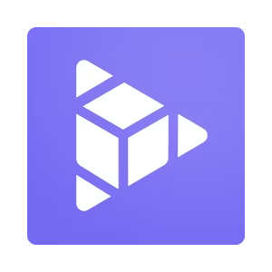
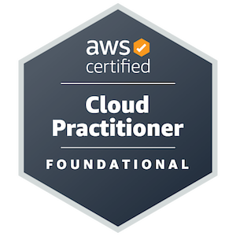

## Hi, I'm Bach 👋

🔭 I'm a web developer with a few years of experiences

🌱 Currently fiddling with Three.js and cloud technologies

🤔 Achieved some certificates along the way (and hungry for more 💪)

