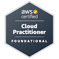
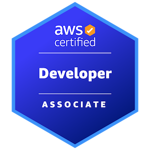

## Hi, I'm MortredN (or Bach Viet Ha) 👋

I'm a web developer who:

🔭 has a few years of front-end experience in React & Next.js
  
🌱 is currently learning Three.js to explore front-end options, and cloud technologies to go into the DevOps field

🚀 worked at:
  - <a href="https://superjoi.com"> Superjoi</a>
  - <a href="https://www.pvcombank.com.vn"> PVcomBank</a>
  - <a href="https://cmcglobal.com.vn"> CMC Global</a>

🤔 achieved some certificates along the way (and hungry for more):

